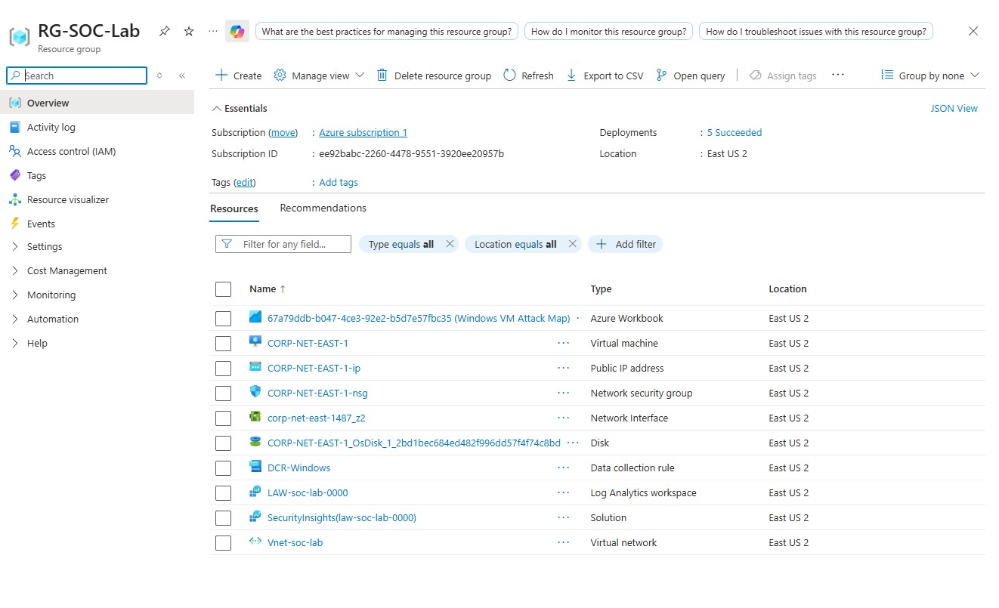
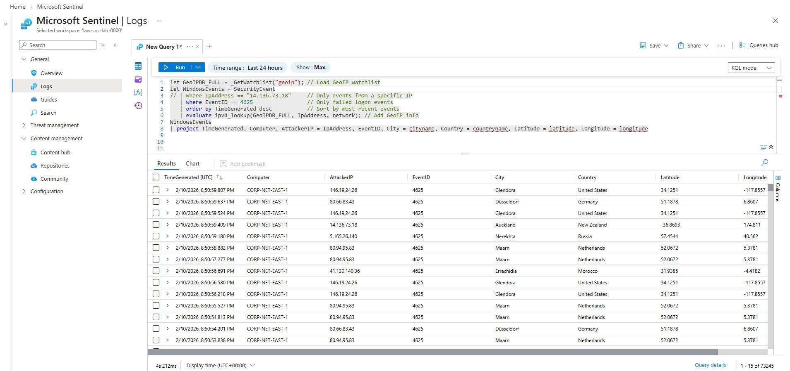
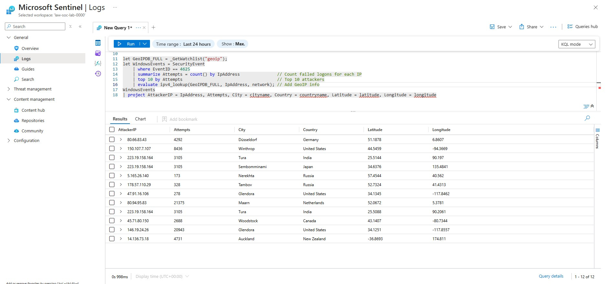
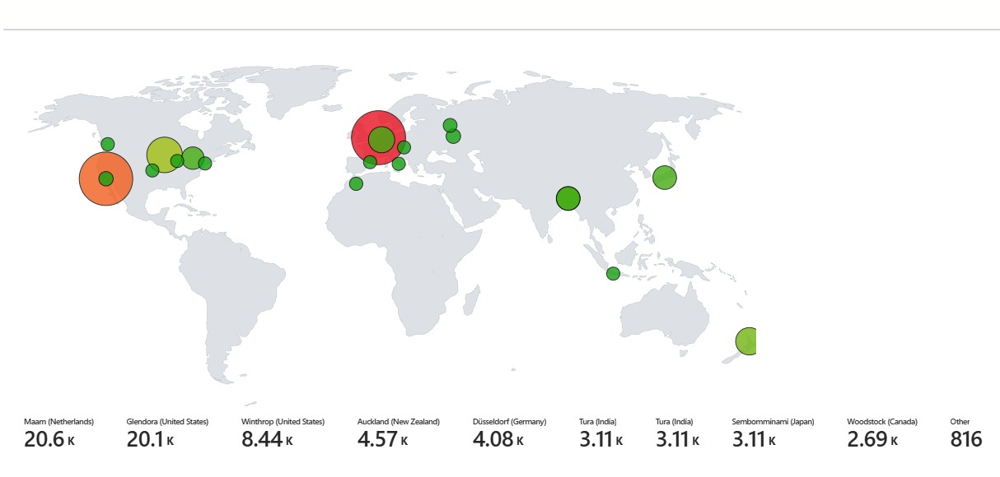

# Azure Home SOC Lab (Windows VM | Microsoft Sentinel)

## Overview

This project demonstrates a cloud-based home Security Operations Center (SOC). A Windows VM was deployed in Azure as a honeypot, and its system and security logs were forwarded to Microsoft Sentinel. Failed login attempts and real-world attack activity were collected, analyzed, and visualized.

## Objectives

- Deploy a Windows VM honeypot in Azure.

- Forward logs to Microsoft Sentinel for centralized monitoring.

- Detect and analyze failed login attempts and brute-force activity.

- Visualize attacker locations and build a real-time attack map.

- Practice SOC operations, log analysis, and threat detection in a cloud environment.

## Data Collection

- Total events collected: 70,000+ authentication events

- Event focus: Failed logins (EventID 4625)

- Filtering: System/machine noise filtered to identify real-world attackers

## Analysis

- Identified top attacker IPs, countries, and cities.

- Captured sample attacker logs for demonstration.

- Used KQL queries to summarize, filter, and visualize attacks.

## Skills Demonstrated

- Cloud deployment and management (Azure)

- Microsoft Sentinel integration

- Security log analysis and SOC operations

- Threat detection and visualization

- Filtering high-volume event data to identify key threats

## Images

*Azure Resource Group showing honeypot VM deployment*

*Shows total logs collected (70k+ events)*

*Top 10 attacker locations*

*Real-time attack map showing attacker distribution*
